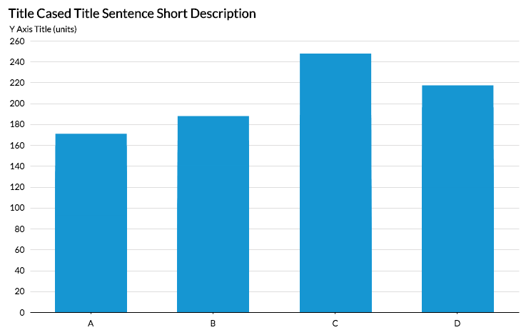
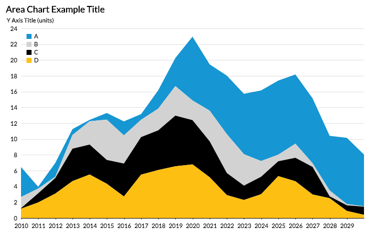
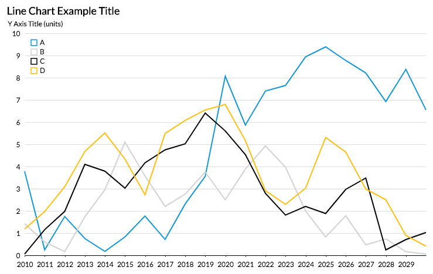

# altair_themes_blog
this repo contains the draft, images, and code for the [Medium blog post on altair themes](https://towardsdatascience.com/consistently-beautiful-visualizations-with-altair-themes-c7f9f889602).

Learn about themes in Altair by recreating the Urban Institute's style (from their [Data Visualization Style Guide](http://urbaninstitute.github.io/graphics-styleguide/)

There are some styles Vega already has put together:

##### fivethirtyeight

##### excel

##### ggplot2

##### vox

Learn to create these:

#### Bar Chart

#### Area Chart (categorical)

#### Area Chart (sequential)

#### Line Chart

