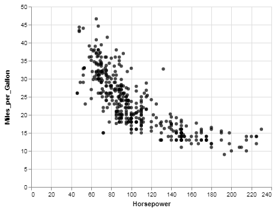
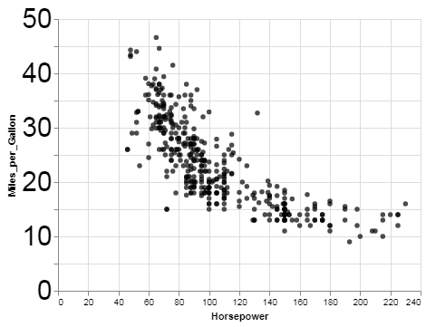
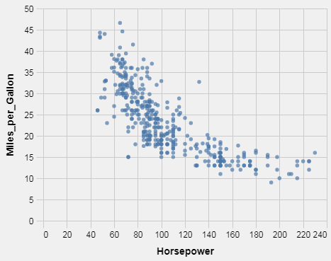
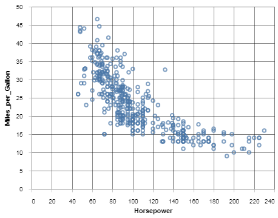
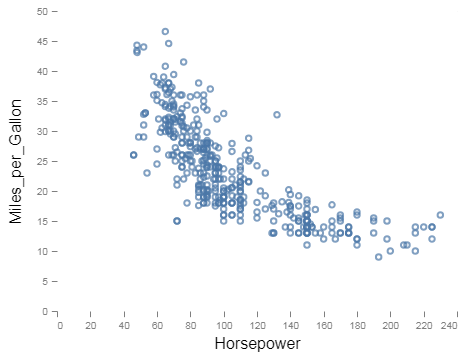
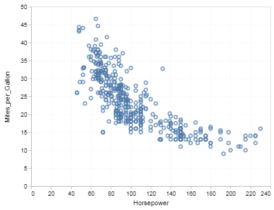

# Consistently beautiful visualizations with `altair` themes

If you are a data visualization fan or practitioner that also uses `python` you may have heard of Jake Vanderplas and Brian Granger's `altair`: _"a declarative statistical visualization library for Python, based on Vega and Vega-lite"_.

> _With Altair, you can spend more time understanding your data and its meaning. Altair’s API is simple, friendly and consistent and built on top of the powerful Vega-Lite visualization grammar. This elegant simplicity produces beautiful and effective visualizations with a minimal amount of code._

If you haven't, you should check out Jake Vanderplas' 2018 PyCon tutorial: https://www.youtube.com/watch?v=ms29ZPUKxbU

***
In this piece we'll be digging deeper into one of `altair`'s less known features: themes. 

### What are `altair` themes?

A theme, in `altair`, is a set of chart configurations applied globally each `python` session. This means you can produce similar-looking visualizations consistently. Maybe you are working on developing a personal style for your blog or maybe you are part of a company that already has a style in place or maybe you hate gridlines and are tired of turning them off every single time you create a chart. 


### Why would that be useful?
Having a styleguide to follow is always a benefit when you are producing data visualizations, whether you are a beginner or expert. Rather than explaining the value of styleguides and consistentcy in your visualizations in this article we will explore how to implement one in `altair`. 

### Themes in `altair`
> _A theme is simply a function that returns a dictionary of default values to be added to the chart specification at rendering time, which is then registered and activated._

Here's a simple example from the docs:
```python
import altair as alt
from vega_datasets import data

# define the theme by returning the dictionary of configurations
def black_marks():
    return {
        'config': {
            'view': {
                'height': 300,
                'width': 400,
            },
            'mark': {
                'color': 'black',
                'fill': 'black'
            }
        }
    }

# register the custom theme under a chosen name
alt.themes.register('black_marks', black_marks)

# enable the newly registered theme
alt.themes.enable('black_marks')

# draw the chart
cars = data.cars.url
alt.Chart(cars).mark_point().encode(
    x='Horsepower:Q',
    y='Miles_per_Gallon:Q'
)
```

`height` and `width` remained the same as the default theme but we have now included `color` and `fill` values to be applied __globally__ (unless otherwise specified) to any charts generated from this point until the end of __this__ `python` session.

This would be the equivalent of 
```python
alt.Chart(cars).mark_point(color = 'black', fill = 'black').encode(
    x='Horsepower:Q',
    y='Miles_per_Gallon:Q'
)
```


in the `black_marks` `config` dictionary returned you can see that we specified the value `black` for the keys `color` and `fill` in `mark`. This is the format all these specifications follow. For example, if you wanted to configure the left axis' label's font size:
```python
def my_theme():
    return {
        'config': {
            'view': {
                'height': 300,
                'width': 400,
            },
            'mark': {
                'color': 'black',
                'fill': '#000000',
            },
            'axisLeft': {
                'labelFontSize': 30,
            },
        }
    }

# register the custom theme under a chosen name
alt.themes.register('my_theme', my_theme)

# enable the newly registered theme
alt.themes.enable('my_theme')
```


(side note: you can get this ___specifications___ (i.e. `'axisLeft'`) from Vega-Lite's documentation.)

This can be particularly useful if you or your company have a styleguide you have to follow. 
If you don't have a styleguide you can start building one by saving your configurations on your personal theme rather than in your code (it pays off long-term!).

Vega already has some [themes on GitHub](https://github.com/vega/vega-themes/tree/master/src).

#### fivethirtyeight

#### excel

#### ggplot2

#### vox

***
As an excersize let's implement the [Urban Institute styleguide](http://urbaninstitute.github.io/graphics-styleguide/) as a theme in `altair`

